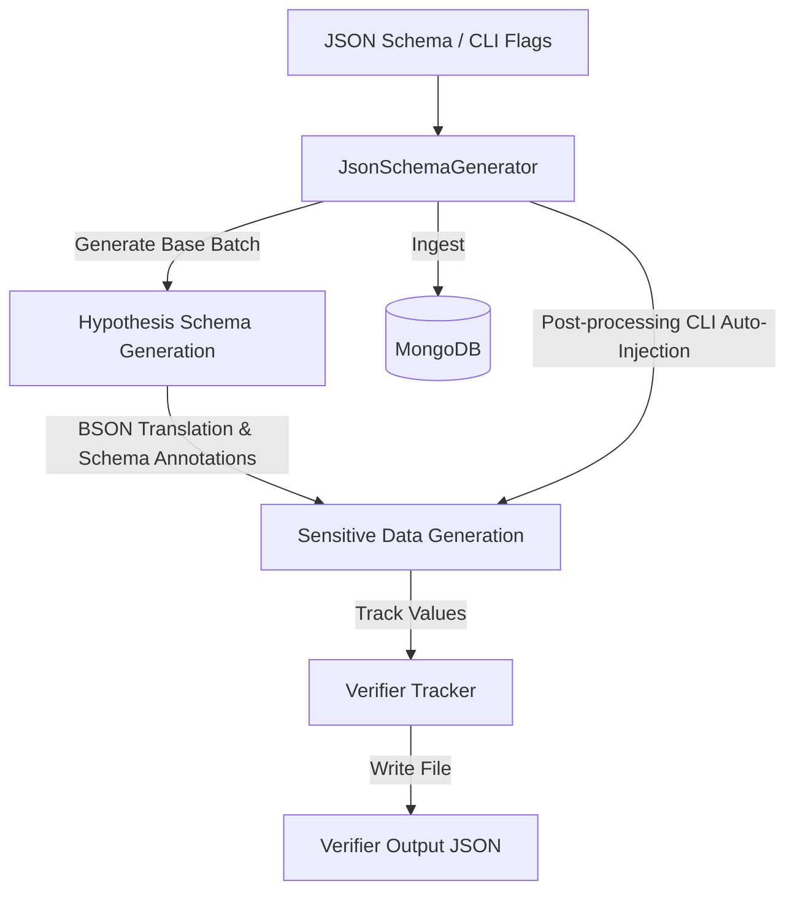

# Guide: Implementing Sensitive Data Generation & Leak Verifier List in mongo-synth

This guide details how to implement support for generating synthetic sensitive data (Personally Identifiable Information & Credentials) and exporting a leak verifier list in `mongo-synth`.

---

## 1. Architecture & Design Goals

To generate realistic mock databases that can be audited for security leaks, we need a mechanism that:
1. **Generates realistic sensitive data** using libraries (`faker` for PII, `secrets` for passwords/API keys) instead of hardcoded strings.
2. **Supports two modes of injection**:
   - **Schema-driven annotations**: Explicitly marking fields in the JSON Schema (e.g., `"sensitiveType": "email"`).
   - **Automatic injection (CLI-driven)**: Appending a set of default sensitive fields to all generated documents via `--inject-sensitive`.
3. **Collects and exports a "verifiers list"**: Saving all generated sensitive values to a designated file using `--verifier-output <path>`. This file serves as a tripwire checklist for checking external leaks.
4. **Supports Canary Run Tagging**: A `--run-id <id>` (or `--salt`) CLI option to prefix generated sensitive values (like emails or API keys) to allow pinpointing which specific pipeline or test run leaked the data.

---

## 2. Technical Strategy



### 2.1 Supported Sensitive Types
We will support the following categories of sensitive data:
*   `name`: Full personal names.
*   `email`: Email addresses.
*   `phone`: Phone numbers.
*   `ssn`: Social Security Numbers or national IDs.
*   `credit_card`: Credit card numbers.
*   `address`: Postal addresses.
*   `password`: Cryptographically secure passwords.
*   `api_key`: Realistic API keys (e.g., simulating AWS/Stripe key shapes).

---

## 3. Step-by-Step Code Modifications

### 3.1 Step 1: Create the Sensitive Data Utility & Tracker (`sensitive.py`)

Create a new file `src/mongo_synth/generators/sensitive.py` containing the generator logic and value tracking.

```python
# src/mongo_synth/generators/sensitive.py
import secrets
import string
from typing import Any, Dict, List, Optional
from faker import Faker

class SensitiveDataTracker:
    def __init__(self, run_id: Optional[str] = None):
        self.faker = Faker()
        self.verifiers: List[Dict[str, str]] = []
        self.run_id = run_id

    def clear(self):
        self.verifiers.clear()

    def track(self, data_type: str, value: str):
        self.verifiers.append({
            "type": data_type,
            "value": value
        })

    def generate_value(self, sensitive_type: str) -> str:
        """Generates a value for a given sensitive type using libraries, not hardcoding."""
        prefix = f"{self.run_id}_" if self.run_id else ""
        val = ""
        if sensitive_type == "name":
            val = prefix + self.faker.name()
        elif sensitive_type == "email":
            local_part, domain = self.faker.email().split("@", 1)
            val = f"{prefix}{local_part}@{domain}"
        elif sensitive_type == "phone":
            val = self.faker.phone_number()
        elif sensitive_type == "ssn":
            val = self.faker.ssn()
        elif sensitive_type == "credit_card":
            val = self.faker.credit_card_number()
        elif sensitive_type == "address":
            val = self.faker.address().replace("\n", ", ")
        elif sensitive_type == "password":
            # Generate a cryptographically secure password
            chars = string.ascii_letters + string.digits + "!@#$%^&*"
            val = prefix + "".join(secrets.choice(chars) for _ in range(16))
        elif sensitive_type == "api_key":
            # Generate a realistic AWS-style or generic API key
            val = f"key_live_{prefix}{secrets.token_hex(20)}"
        else:
            val = prefix + self.faker.word()

        self.track(sensitive_type, val)
        return val

    def auto_inject(self, doc: Dict[str, Any]) -> Dict[str, Any]:
        """Automatically appends sensitive fields to a document."""
        if not isinstance(doc, dict):
            return doc
        
        doc["personal_info"] = {
            "full_name": self.generate_value("name"),
            "email": self.generate_value("email"),
            "phone": self.generate_value("phone"),
            "ssn": self.generate_value("ssn"),
            "address": self.generate_value("address")
        }
        doc["billing"] = {
            "credit_card": self.generate_value("credit_card")
        }
        doc["credentials"] = {
            "password": self.generate_value("password"),
            "api_key": self.generate_value("api_key")
        }
        return doc
```

---

### 3.2 Step 2: Update the Base Generator (`base.py`)

Modify `src/mongo_synth/generators/base.py` to:
1. Initialize the `SensitiveDataTracker`.
2. Process custom `"sensitiveType"` properties in JSON schemas during standard generation.
3. Apply automatic injection when configured.

Add the following import at the top:
```python
from mongo_synth.generators.sensitive import SensitiveDataTracker
```

Update `BaseGenerator.__init__` to initialize the tracker:
```python
    def __init__(self, blueprint: Dict[str, Any], documents_per_collection: int, seed: Any = None):
        self.blueprint = blueprint
        self.schema = blueprint.get("schema", {})
        self.metadata = blueprint.get("metadata", {})
        self.documents_per_collection = documents_per_collection
        self.seed = seed
        
        run_id = self.metadata.get("run_id")
        self.sensitive_tracker = SensitiveDataTracker(run_id=run_id)
```

Update `apply_bson_translation` to recognize and generate sensitive data based on custom JSON Schema attributes:
```python
        # Check custom sensitive annotations
        sensitive_type = schema.get("sensitiveType")
        if sensitive_type:
            return self.sensitive_tracker.generate_value(sensitive_type)
```

Modify the end of `generate_batch` to perform auto-injection if requested in the metadata/config:
```python
        # Replicate to target count if count exceeds pool_size
        # ... (existing replication logic) ...

        # Apply distribution profile to the batch
        batch = self.apply_distribution_profile(batch)

        # Auto-inject sensitive PII if enabled
        if self.metadata.get("inject_sensitive", False):
            batch = [self.sensitive_tracker.auto_inject(doc) for doc in batch]

        return batch
```

---

### 3.3 Step 3: Integrate into CLI (`cli.py`)

Add the CLI options `--inject-sensitive` and `--verifier-output` to `src/mongo_synth/cli.py` to enable command-line execution and file export.

1. Locate the `--clear` argument inside `run_generation` and add the new options to `gen_parser`:
```python
    gen_parser.add_argument("--inject-sensitive", action="store_true", help="Automatically inject sensitive PII/secrets fields into all documents")
    gen_parser.add_argument("--verifier-output", help="Path to write the JSON leak verifier list file")
    gen_parser.add_argument("--run-id", help="Canary run identifier to prefix/salt sensitive values with")
```

2. Inside `run_generation`, pass the options to the blueprint metadata:
```python
    # Configure blueprint metadata expected count
    if "metadata" not in blueprint:
        blueprint["metadata"] = {}
    blueprint["metadata"]["expected_document_count"] = count
    blueprint["metadata"]["inject_sensitive"] = args.inject_sensitive
    blueprint["metadata"]["run_id"] = args.run_id
```

3. Export the leak verifier list if `--verifier-output` was specified:
```python
    # 5. Generate batch data
    logger.info(f"Generating {count} synthetic documents...")
    try:
        documents = generator.generate_batch()
    except Exception as e:
        logger.error(f"Failed to generate documents: {e}", exc_info=True)
        sys.exit(1)

    # Export verifier list
    if args.verifier_output:
        verifiers = generator.sensitive_tracker.verifiers
        logger.info(f"Writing {len(verifiers)} verifiers to {args.verifier_output}...")
        try:
            with open(args.verifier_output, "w") as f:
                json.dump(verifiers, f, indent=2)
            logger.info("Verifier list written successfully.")
        except Exception as e:
            logger.error(f"Failed to write verifier file: {e}")
```

---

## 4. Verification Workflow

### 4.1 Schema-Driven Verification
Define a schema file `schema_with_pii.json`:
```json
{
  "type": "object",
  "properties": {
    "_id": {"type": "string", "bsonType": "objectId"},
    "username": {"type": "string"},
    "secret_token": {"type": "string", "sensitiveType": "api_key"},
    "personal_email": {"type": "string", "sensitiveType": "email"}
  },
  "required": ["username", "secret_token", "personal_email"]
}
```

Run CLI command:
```bash
mongo-synth generate \
  --schema schema_with_pii.json \
  --db test_db \
  --collection users \
  --count 10 \
  --verifier-output verifiers.json
```

Assert that:
1. `secret_token` matches the `key_live_*` shape.
2. `personal_email` matches a valid email shape.
3. `verifiers.json` contains a structured JSON array of 20 verifier values (10 documents * 2 fields).

### 4.2 Auto-Injection Verification
Run CLI command:
```bash
mongo-synth generate \
  --schema standard_schema.json \
  --db test_db \
  --collection users \
  --count 5 \
  --inject-sensitive \
  --run-id stage_run_99 \
  --verifier-output verifiers_auto.json
```

Assert that:
1. Documents inserted in `test_db.users` contain nested `personal_info`, `billing`, and `credentials` sub-documents.
2. Sensitive fields contain values prepended with `stage_run_99_` (e.g., `stage_run_99_john.doe@example.com` or `key_live_stage_run_99_...`).
3. All dynamically generated values are stored inside `verifiers_auto.json`.

---

## 5. Ingestion Best Practice: BulkWriteError Handling

When bulk-inserting high volumes of synthetic documents into MongoDB, random values generated for unique fields (like SSNs or email addresses) may conflict with existing indexes, raising a `BulkWriteError` (error code `11000`).

To ensure that ingestion doesn't crash the entire generation program, we should catch duplicate key violations and log them as warnings, returning the actual number of successfully written records.

### Implementation inside `src/mongo_synth/ingestion/data_ingester.py`

Modify `DataIngester._insert_batch` to handle `BulkWriteError` from PyMongo:

```python
    def _insert_batch(self, batch: list) -> int:
        """
        Helper method to insert a batch of documents into the collection.
        Uses ordered=False to maximize insertion speed and prevent a single error from halting the entire batch.
        """
        from pymongo.errors import BulkWriteError
        try:
            result = self.target_collection.insert_many(batch, ordered=False)
            return len(result.inserted_ids)
        except BulkWriteError as bwe:
            # Handle duplicate key / constraint errors gracefully without crashing
            n_inserted = bwe.details.get("nInserted", 0)
            logger.warning(
                f"Gracefully handled bulk write error during ingestion. "
                f"Successfully inserted {n_inserted} of {len(batch)} documents in this batch. "
                f"Errors: {len(bwe.details.get('writeErrors', []))}"
            )
            return n_inserted
        except Exception as e:
            logger.error(f"Catastrophic error occurred during batch insertion: {e}")
            raise
```

Update `DataIngester.ingest` to accumulate the actual written count:
```python
    def ingest(self, documents: Iterable[Dict[str, Any]]) -> int:
        total_inserted = 0
        current_batch = []

        for doc in documents:
            current_batch.append(doc)

            if len(current_batch) >= self.batch_size:
                inserted = self._insert_batch(list(current_batch))
                total_inserted += inserted
                current_batch.clear()

        # Insert any remaining documents
        if current_batch:
            inserted = self._insert_batch(list(current_batch))
            total_inserted += inserted

        return total_inserted
```


