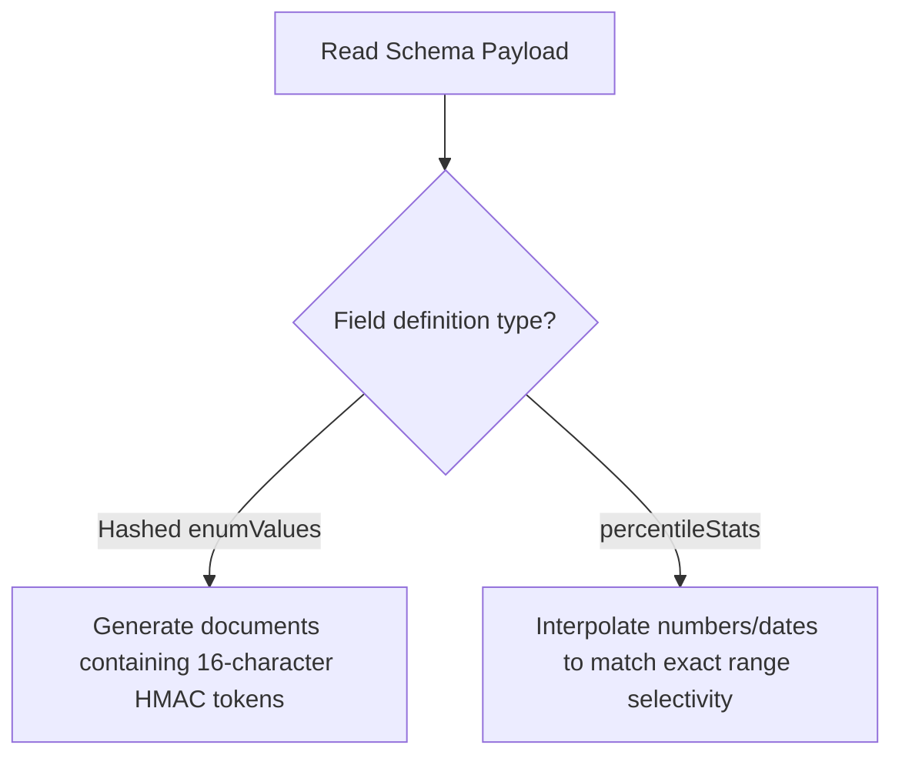

# ToDo Task: Multi-Mode Support — mongo-synth Extensions (Code-Aligned Clean Spec)

## 1. Description
This task specifies the extensions required in our owned python data synthesis engine dependency `mongo-synth` (located inside site-packages) to support percentile-aware numeric range generation and hashed enum seeding, directly aligned with the output formats of `mongo-schema-fetch` version 1.5.0.

---

## 2. Technical Specification & Pipeline Integration

`mongo-synth` must ingest and generate BSON documents based on the two metadata structures added by `mongo-schema-fetch` 1.5.0:



### 2.1. Ingestion of Hashed Enums
* [x] **Format**: `mongo-schema-fetch` outputs categorical string values as 16-character hexadecimal HMAC hashes (e.g. `"enumValues": ["b8f9a2c3d4e5f678", "e5f678a2b8f9a2c3"]`).
* [x] **Generator Alignment**:
    `mongo-synth` must parse this properties array directly. Instead of generating random mock strings, it seeds the collection fields by drawing from these hashed enum tokens using the skewed probabilities defined in `metadata.distribution`.

### 2.2. Percentile-Aware Piecewise Linear Interpolation
* [x] **Format**:
    For range query boundaries, the schema contains a metadata block:
    ```json
    "percentileStats": {
      "fieldName": "price",
      "boundaryValue": 100.0,
      "lowerPercentile": 0.3
    }
    ```
* [x] **Interpolation Math**:
    To target exactly $30\%$ selectivity for $Price < 100$, the generator must:
    1. Sort the generated float/int/date array of size $N$ for the field.
    2. Divide the sorted array at index $M = \lfloor N \times lowerPercentile \rfloor$.
    3. Scale values at indices $0 \le i < M$ linearly between the minimum generated value and the `boundaryValue` ($100.0$).
    4. Scale values at indices $M \le i < N$ linearly between `boundaryValue` ($100.0$) and the maximum value.
* [x] **Piecewise Scaling Equation**:
    For index $i$ in sorted values:
    *   If $i < M$:
        $$Val_i = Min + (Boundary - Min) \times \frac{i}{M}$$
    *   If $i \ge M$:
        $$Val_i = Boundary + (Max - Boundary) \times \frac{i - M}{N - M}$$

---

## 3. Comprehensive Acceptance Criteria (20 Tests)

### Scenario 1: Piecewise Linear Range Generation (10 Tests)

* [x] **Test 1.1: Exact Selective Split Accuracy**
    *   *Input boundary*: `boundaryValue = 100.0`, `lowerPercentile = 0.3`.
    *   *Verification*: Assert that in the generated collection, exactly $30\%$ of the documents have values less than $100.0$.
* [x] **Test 1.2: Skewed Boundary Value Retention**
    *   *Input boundary*: `boundaryValue = 50.0`, `lowerPercentile = 0.9` (heavy skew).
    *   *Verification*: Assert that exactly $90\%$ of the generated batch values are smaller than $50.0$.
* [x] **Test 1.3: Range Selectivity Query Parity ($gt$)**
    *   *Step*: Query `{"price": {"$gt": 100.0}}` on a generated batch of 10,000 documents.
    *   *Verification*: Assert exactly $70\%$ ($1.0 - 0.3$) of documents match the query.
* [x] **Test 1.4: Date Range Interpolation**
    *   *Input boundary*: `boundaryValue = "2026-01-01T00:00:00Z"`, `lowerPercentile = 0.5`.
    *   *Verification*: Assert generated BSON dates are split exactly at the target timestamp, matching the 50% selectivity boundary.
* [x] **Test 1.5: Float/Integer Coercion**
    *   *Step*: Field type is defined as `integer`.
    *   *Verification*: Assert all interpolated values are rounded to integers.
* [x] **Test 1.6: Boundary Identity Safety**
    *   *Input percentiles*: `lowerPercentile = 1.0` (all values below boundary).
    *   *Verification*: Assert all generated values fall below the boundary without out-of-bounds scale overflows.
* [x] **Test 1.7: Null Value Preservation**
    *   *Step*: Schema allows `null` values.
    *   *Verification*: Assert null values are ignored during rank sorting and remain null.
* [x] **Test 1.8: Scaling Stream Chunk Consistency**
    *   *Step*: Generate 100,000 documents in chunks of 5,000.
    *   *Verification*: Assert the target percentile selectivity remains stable across all generated chunk streams.
* [x] **Test 1.9: Deterministic Seeding Parity**
    *   *Step*: Run synthesis twice with the same seed `42`.
    *   *Verification*: Verify the exact sequence of generated numeric values matches.
* [x] **Test 1.10: Default Schema Fallback**
    *   *Step*: Input a schema without `percentileStats` metadata.
    *   *Verification*: Assert fallback to standard random data generation occurs without throwing errors.

---

### Scenario 2: Hashed Enum Seeding (10 Tests)

* [x] **Test 2.1: 16-Character String Constraint**
    *   *Step*: Generate string values for a field containing hashed `enumValues`.
    *   *Verification*: Assert all generated strings are exactly 16-character hex tokens.
* [x] **Test 2.2: Point Query Selectivity Parity ($eq$)**
    *   *Step*: Assign a 90% weight to `TokenA` and 10% to `TokenB`.
    *   *Verification*: Assert query `{"status": "TokenA"}` matches exactly 90% of generated documents.
* [x] **Test 2.3: Nested Object Enum Seeding**
    *   *Input*: Object property containing hashed enums.
    *   *Verification*: Assert nested documents are populated with the correct tokens.
* [x] **Test 2.4: Array Enum Seeding**
    *   *Input*: List of hashed enums for an array field.
    *   *Verification*: Assert each item in the array is chosen from the allowed token set.
* [x] **Test 2.5: Unique Index Collision Prevention**
    *   *Step*: Generate hashed tokens for a field marked with a unique index.
    *   *Verification*: Assert the generator appends unique integer prefixes to prevent index insertion crashes.
* [x] **Test 2.6: Empty Token Fallback**
    *   *Input*: Empty enum list `[]`.
    *   *Verification*: Verify generator falls back to generating random strings.
* [x] **Test 2.7: Character Set Validation**
    *   *Step*: Assert all generated hashed enums contain only hex characters `[0-9a-f]`.
* [x] **Test 2.8: Case Sensitivity Integrity**
    *   *Step*: Run query using uppercase hex tokens.
    *   *Verification*: Assert generator matches exactly, maintaining case consistency.
* [x] **Test 2.9: Multiple Enum Fields Mapping**
    *   *Step*: Define two distinct hashed enum fields (`status` and `role`).
    *   *Verification*: Assert both fields are generated independently using their respective token sets.
* [x] **Test 2.10: Zero Data Leak Verification**
    *   *Step*: Scan all synthetic values generated.
    *   *Verification*: Assert that no plaintext production strings are leaked in the output database.
